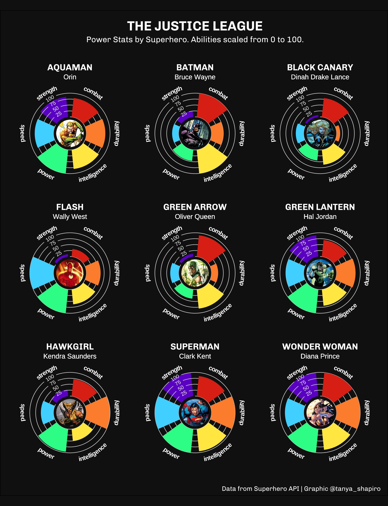
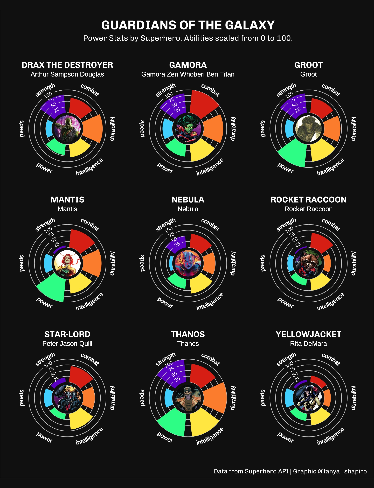

# Superheroes & Villains

This project collects data using the [Superhero API](https://www.superheroapi.com/) to explore individual comic book character backgrounds. Data was compiled using R (httr & jsonlite packages), code for data collection process can be found [here](https://github.com/tashapiro/superhero-comics/blob/main/code/superhero-api-data-collection.R). 

Visualizations created with the help of **ggplot2** and ggplot extensions, **geomtext_path** and **ggimage**. 

## Data

Data dictionary can be found [here](https://github.com/tashapiro/superhero-comics/blob/main/data/README.md).

Information collected from Superhero API. The dataset contains biographical information about each comic book character (e.g. name, place of birth, species), character associaitions (e.g. affiliations, relatives), as well as power stat information scaled from 0-100 (e.g. strength, durability, intelligence).

Characters are from various different comic book publishers, including but not limited to DC Comics, Marvel Comics, and Dark Horse comics  The data consists of a total of 731 different characters.

## Visualizations

### Justice League

### The Avengers

### Guardians of The Galaxy

